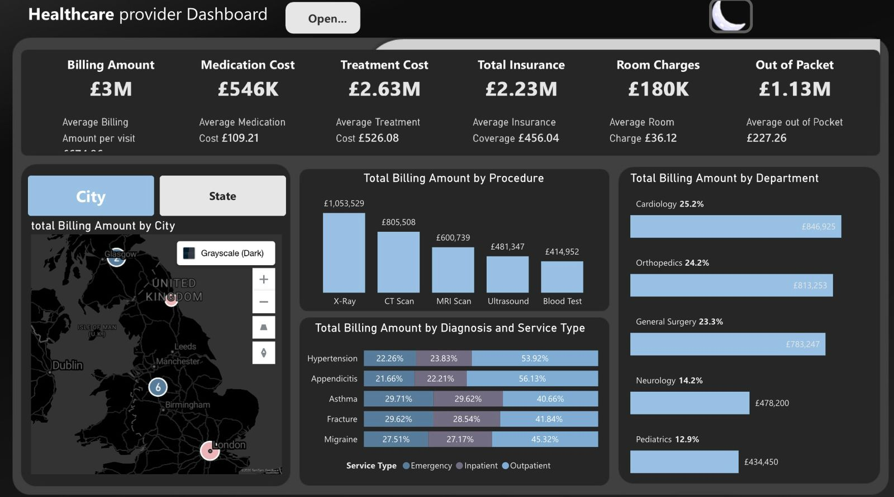
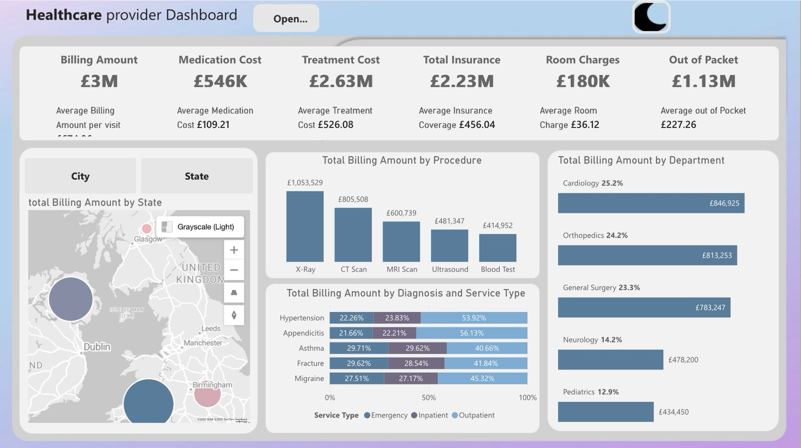

# Healthcare Provider Dashboard

## Overview

This project is an interactive **Healthcare Provider Dashboard** built with **Power BI** to analyze healthcare billing, treatment costs, insurance coverage, room charges, and patient out-of-pocket expenses.

The dashboard provides a clear financial and operational view of healthcare visits, helping users compare costs across procedures, departments, diagnoses, service types, cities, and states.

## Business Problem

Healthcare providers need a simple way to monitor billing performance, cost distribution, and patient financial responsibility across different medical services. This dashboard helps answer key business questions such as:

- Which procedures generate the highest billing amount?
- Which departments contribute the most to total billing?
- How much of the total cost is covered by insurance?
- What is the average out-of-pocket cost per patient visit?
- How do billing amounts vary by city or state?
- How are diagnosis categories distributed across service types?

## Tools Used

- **Power BI** – Dashboard design and data visualization
- **Power Query** – Data cleaning and transformation
- **DAX** – Measures and calculated columns
- **Data Modeling** – Relationships between visits, patients, departments, procedures, diagnoses, providers, insurance, and date table

## Dashboard Features

- KPI cards for major financial metrics
- Interactive map to analyze billing by city or state
- Procedure-level billing analysis
- Department-level billing contribution
- Diagnosis and service type comparison
- Filters for patient race, year, quarter, and month
- Light and dark dashboard themes
- Field parameter / switch button to toggle between city and state analysis

## Key Metrics

| Metric | Value |
| --- | ---: |
| Total Billing Amount | £3M |
| Total Medication Cost | £546K |
| Total Treatment Cost | £2.63M |
| Total Insurance Coverage | £2.23M |
| Total Room Charges | £180K |
| Total Out-of-Pocket | £1.13M |
| Average Medication Cost | £109.21 |
| Average Treatment Cost | £526.08 |
| Average Insurance Coverage | £456.04 |
| Average Room Charge | £36.12 |
| Average Out-of-Pocket | £227.26 |

## Data Preparation

The data preparation process included:

- Creating a dedicated **Date Table** using `CALENDARAUTO()`
- Adding date-related columns such as year, month, month number, quarter, weekday, week number, and week type
- Marking the Date Table as the official date table in Power BI
- Creating relationships between the Date Table and the visits table using visit/admitted date fields
- Creating a calculated column for **Length of Stay** using the difference between admitted date and discharge date
- Building DAX measures for billing, medication cost, treatment cost, insurance coverage, room charges, out-of-pocket cost, and patient count
- Organizing measures into folders for better model readability
- Creating percentage measures for department and procedure contribution

## Main DAX Measures

```DAX
Total Medication Cost = SUM(visits[Medication Cost])
```

```DAX
Total Treatment Cost = SUM(visits[Treatment Cost])
```

```DAX
Total Insurance Covered = SUM(visits[Insurance Coverage])
```

```DAX
Length of Stay = DATEDIFF(visits[Admitted Date], visits[Discharge Date], DAY)
```

```DAX
Total Room Charges = SUMX(visits, visits[Room Charges (Daily Rate)] * visits[Length of Stay])
```

```DAX
Total Billing Amount = [Total Medication Cost] + [Total Room Charges] + [Total Treatment Cost]
```

```DAX
Out of Pocket = [Total Billing Amount] - [Total Insurance Covered]
```

```DAX
Total Patients = DISTINCTCOUNT(visits[Patient ID])
```

```DAX
Average Billing Amount per Visit = DIVIDE([Total Billing Amount], [Total Patients])
```

```DAX
Average out of Pocket = DIVIDE([Out of Pocket], [Total Patients])
```

## Key Insights

- **X-Ray** had the highest total billing amount at approximately **£1.05M**, followed by **CT Scan** at **£805K**.
- **Cardiology** was the top department by billing contribution, representing **25.2%** of total billing with approximately **£846.9K**.
- **Orthopedics** and **General Surgery** also contributed strongly, accounting for **24.2%** and **23.3%** of total billing respectively.
- **Outpatient services** represented the largest share across several diagnosis categories, especially for **Hypertension** and **Appendicitis**.
- Total insurance coverage reached **£2.23M**, while patient out-of-pocket costs reached approximately **£1.13M**.
- The dashboard allows deeper analysis by filtering patients by race and date hierarchy, making it easier to identify cost patterns across patient groups and time periods.

## Dashboard Preview

### Dark Mode



### Light Mode



## Project Structure

```text
Healthcare-Provider-Dashboard/
│
├── README.md
├── dashboard-dark.png
├── dashboard-light.png
├── Healthcare-Provider-Dashboard.pbix
└── dataset/
```

## What I Learned

Through this project, I practiced building an end-to-end Power BI dashboard, including data modeling, DAX measure creation, KPI design, field parameters, map visualization, interactive filters, and dashboard theme customization.

This project also strengthened my ability to turn healthcare data into clear business insights that support financial analysis and operational decision-making.

## Author 

**Aryam Aljarallah**

